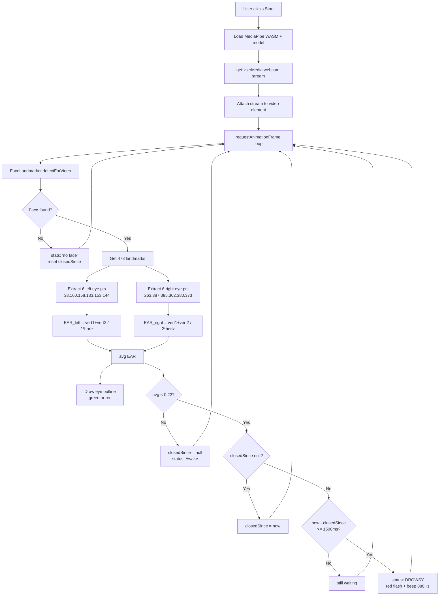

# Drowsy Detector — Flow

```mermaid
flowchart TD
    A[User clicks Start] --> B[Load MediaPipe WASM + model]
    B --> C[getUserMedia webcam stream]
    C --> D[Attach stream to video element]
    D --> E[requestAnimationFrame loop]

    E --> F[FaceLandmarker.detectForVideo]
    F --> G{Face found?}
    G -->|No| H[stats: 'no face'<br/>reset closedSince]
    G -->|Yes| I[Get 478 landmarks]

    I --> J[Extract 6 left eye pts<br/>33,160,158,133,153,144]
    I --> K[Extract 6 right eye pts<br/>263,387,385,362,380,373]

    J --> L[EAR_left = vert1+vert2 / 2*horiz]
    K --> M[EAR_right = vert1+vert2 / 2*horiz]
    L --> N[avg EAR]
    M --> N

    N --> O[Draw eye outline<br/>green or red]
    N --> P{avg < 0.22?}

    P -->|No| Q[closedSince = null<br/>status: Awake]
    P -->|Yes| R{closedSince null?}
    R -->|Yes| S[closedSince = now]
    R -->|No| T{now - closedSince<br/>>= 1500ms?}
    T -->|No| U[still waiting]
    T -->|Yes| V[status: DROWSY<br/>red flash + beep 880Hz]

    H --> E
    Q --> E
    S --> E
    U --> E
    V --> E
```

## EAR (Eye Aspect Ratio)

`EAR = (|p2-p6| + |p3-p5|) / (2 * |p1-p4|)`

- Open eye ~0.3
- Closed eye ~0.1
- Threshold: 0.22
- Sustained < threshold for 1500ms = drowsy
